# Github Intro Tutorial

### The Basics
Github is designed for teams to collaborate with each other on shared files and folders, whether it be text documents or code. Think of it somewhat like Google Drive and Google Docs but for code. Multiple people can work on and make changes to the same file at the same time, create their own versions of the file, or collaboratively accept and reject certain changes from others. 

For basic use in the case of the Simio team, we won't be creating repositories (shared folders / file systems), so we will first focus on copying and getting connected to the proper repository. 

## Setup
Make sure that you have Git installed on your computer, the setup will be slightly different for Windows or Mac, but it should walk you through it [at this link](https://git-scm.com/downloads).
For Windows I often use the Git Bash, there are a variety of other things that you can use including GitKraken, which we will cover later. For the purposes of this tutorial, I think it is valuable to learn how to use git manually from the terminal / command line.

### Note
If you are trying to connect to a service that utilizes git, like GitKraken, that requires secret tokens or authentication keys, those can be found by doing the following:
**Click on your Avatar in the top right Corner of Github**

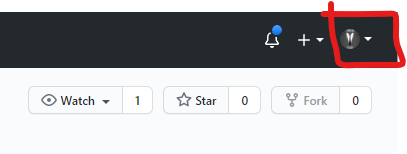

**Then click on Settings**

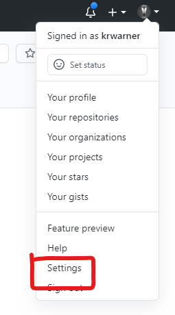

**Next click Developer Settings**

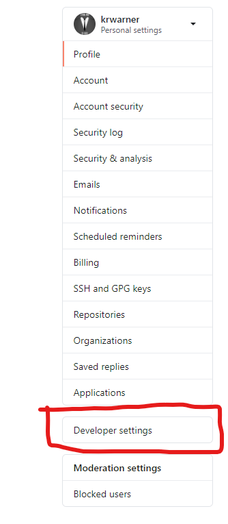

**After that, click on Personal access tokens**

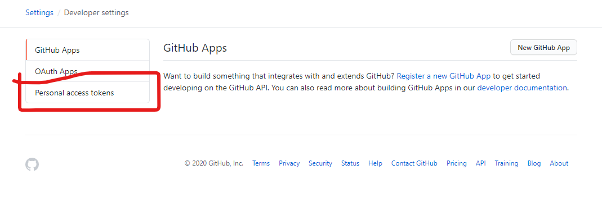

**Finally, click on Generate new token**

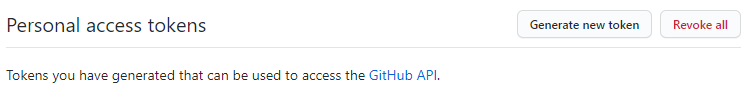

At this point you should be able to copy and past the tokens wherever you need them. I recommend you store these in a secure location, and **NEVER** commit / push these to GitHub or any other place where they can be publically accessed. They should be treated just like passwords. 

## Step 1 - Locate Repository Link
Naivgate to: [AegisPremierTechnologies/Simio](https://github.com/AegisPremierTechnologies/Simio)

You should see something like 
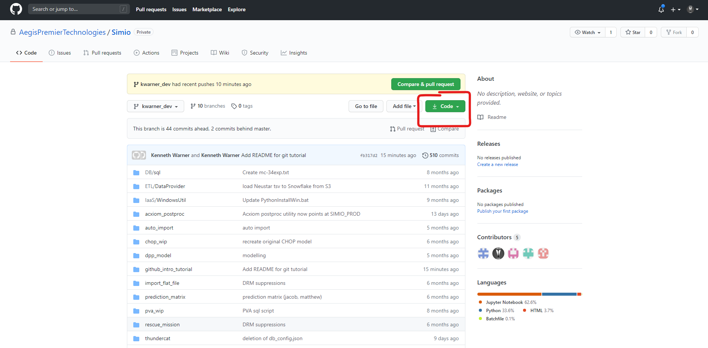


Click on the green button that says Code and you should see:

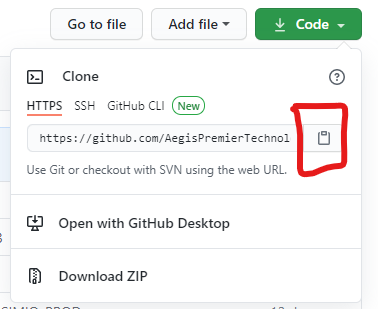

Copy the link in that box. 


## Step 2 - Cloning the Repository
Open up your terminal / command line, in this case I am using Git Bash, you can use what you wish as long as you have it working with git. 
In the window, navigate to the folder that you want the code to download into. To do that you can use the command:
```
cd "folder name"/"subfolder name"/"tertiary folder name"
```
It doesn't have to go that far if you want a higher level directory for the code, like "Documents". In that case you would enter:
```
cd documents
```
Into the command line just like the image below. CD means, change directory, this is using the command line to navigate you, as a user, into the folder "Documents", everthing that you do here will make changes within that folder. 

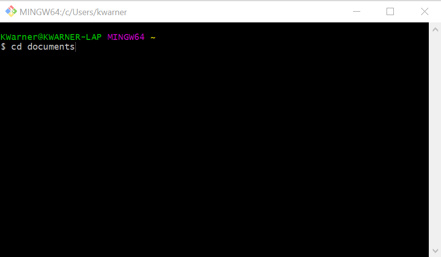

Once you are in the appropriate folder, enter the following into the command line and hit enter:
```
git clone https://github.com/AegisPremierTechnologies/Simio.git
```
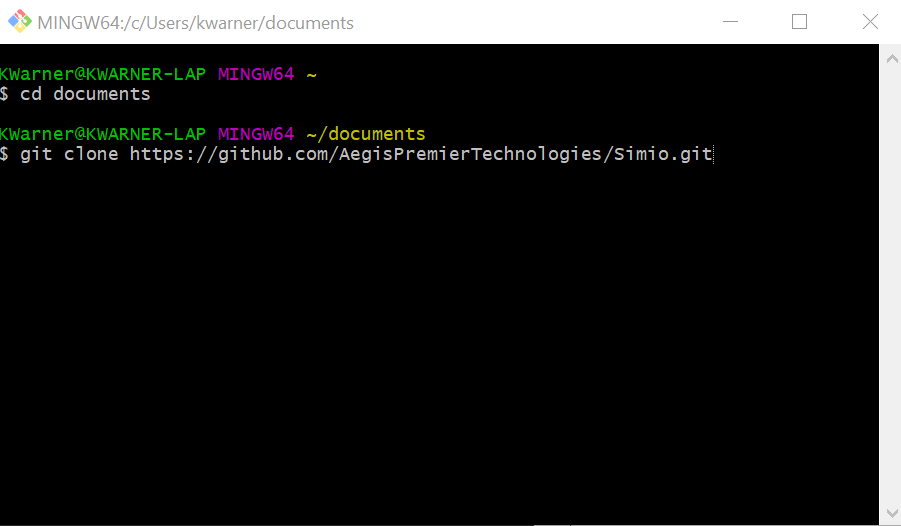

You should see some things downloading and at the end it should say "Done". At this point, if you look at the folder you should see that a folder called Simio was downloaded. Inside that folder is all of our repositories, including the one for this tutorial. 


## Step 3 - Intialize Repository and Create Branch
At this point you now have all the files of the main repository, but it isn't connected to Github (this will be referenced as the "remote" repository) itself. To do that you need to initialize your local repository. First you need to cd into where the files are located, if you haven't done so already. This will look something like:
```
cd Simio
```

Then to initialize the repository, enter the following command:
```
git init
```
At this you should see the word "master" in parenthesis, like the picture below

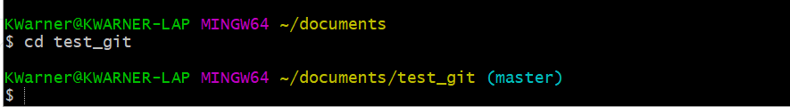

This means that you are on the Master branch, which unless you are very confident in what you are doing or you are merging a pull request, should not be the branch you make changes to any code. Instead you should create your own branch. To do that enter the following command, replacing "your_branch_here" with whatever you want to name your branch:
```
git checkout -b your_branch_here
```
This command does two things, first the "-b" is shorthand for creating a branch. Then, "git checkout" can be thought of like checking out a book from a library, or renting a movie from the long forgotten Blockbuster. It means that you are taking out any code that exists for the particular branch and using it on your local system. Keep in mind that there are both remote (the code that anyone could have committed to Github itself) and local versions of the code. **These are not always the same. If you checked out code from master or any other branch, made changes and then did not commit and push the code back to Github, then checked out different code before coming back to your original branch, the code that you are checking out will be your local copy, not what is on Github.** This is why, as you are checking out code, you should be adding, committing, pushing, fetching, and pulling the code each time. These actions will all be covered later in this tutorial. 


## Step 4 - Add, Commit, Push to Your Branch
Congratulations, you have successfully created your own branch. You should see something like:

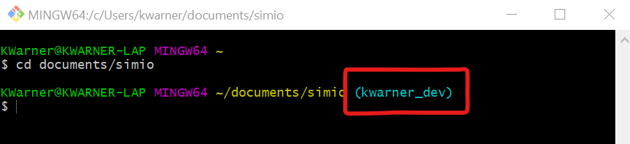

Instead of "master" in parenthesis, you should see the branch name that you just created **Note - Always check this before making any changes and saving**. Now, we can do a little practice and learn the basics of changing files and saving your work to GitHub. 

First, make sure that you cd into simio/github_intro_tutorial/practice. In that directory you should see a file called, "i_was_here.txt". Open that file and add yourself to it. Next, create a new file (if you want to do this from the command line, make sure you are in the correct directory and enter ```touch file_name.txt``` in the same directory called yourfirstname_yourlastname.txt, write a nice note and save it. Finally, find someone who has created their own named file, and make some changes to what they wrote **AND** add a little bit to it. 

Now, in your command line or git bash, enter the following:
``` git add -A ```

This adds / stages all the changes that you have made, including deletions and new files, so that we can prepare to commit and push those changes that have been staged. In the future there are two other basic git add's that are often used:
```git add .``` which adds all modifications and new files, except deletions and
``` git add -u``` which adds modifications and deletions, but not new files. 

git add . + git add -u = git add -A. These likely won't be needed right now though. 

Now that those changes and new files have been staged, let's commit these changes. Enter:
```git commit -m "A message about your commit here"```

In this "-m" means write a message, and the message that comes after should be descriptive of the changes that you are making. By convention, it should always be in the future tense. In this case you could write something like "Change kenny_warner.txt, add my file, edit i_was_here.txt". 

Finally, we need to push these changes so that they are remote. This will officially get them onto GitHub. 
```git push origin your_branch_name``` or as long as everything on remote and local versions are named the same, you can do ```git push origin HEAD```. You are free to use the latter on whatever branch you are on, but if you are trying to push to a specfic branch the former is the best option. 

After that you can check your branch on GitHub, and your changes should be there. Just like that you have made your first changes and pushed everything to GitHub. 

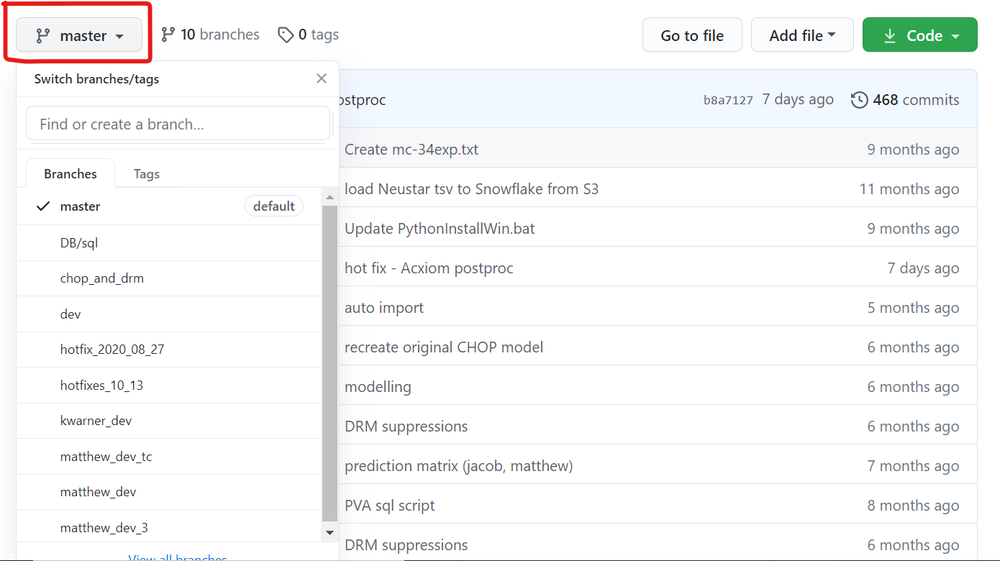


